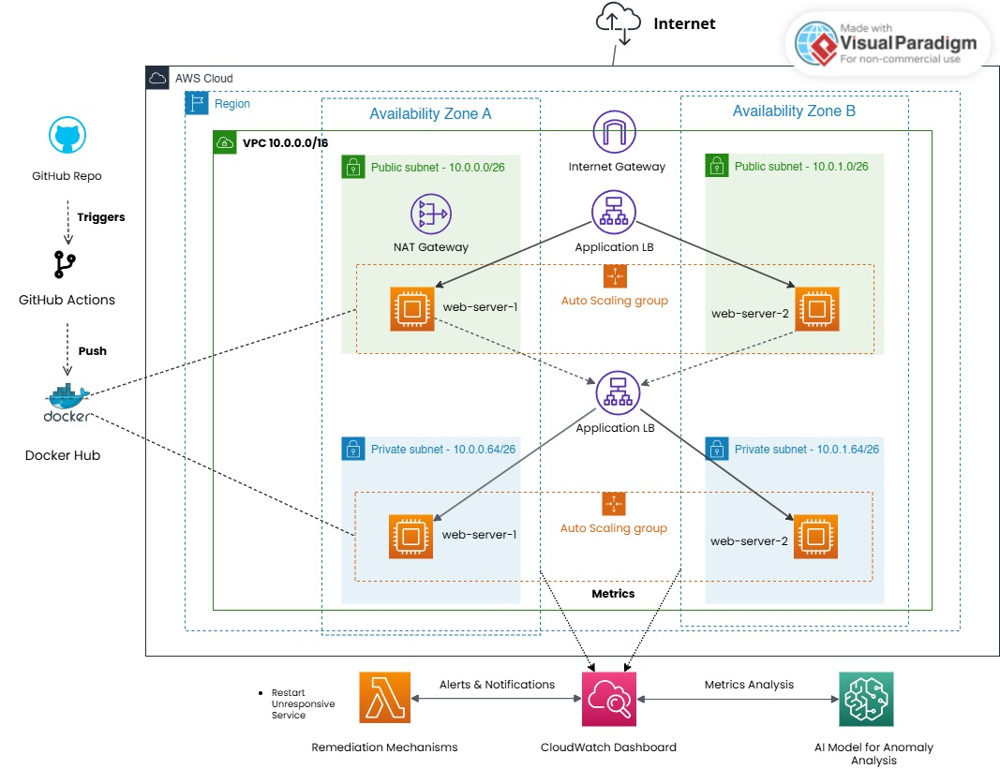

# **AWS Cloud Infrastructure Project**

## **Overview**
This project involved designing, implementing, and deploying a scalable, fault-tolerant, and highly available cloud-based application using AWS. The infrastructure includes a frontend hosted in a public subnet, a backend hosted in a private subnet, and integration with AWS services for monitoring, logging, and automation. The application is containerized, and CI/CD pipelines are utilized for streamlined deployments.

---

## **Objectives**
- Set up a highly available AWS architecture using Terraform.
- Automate monitoring, logging, and remediation processes using CloudWatch and AWS lambda.
- Detect anomalies based on instance's logs by developing and deployed a machine learning using AWS Sagemaker. 
- Integrate CI/CD pipelines for seamless application deployment with GitHub Actions.
- Ensure scalability using Auto Scaling Groups and Load Balancers.
- Utilize Docker for containerization of the frontend and backend.
- Implement efficient log handling and insights via CloudWatch.

---

## **Tasks and Implementation**

### **1. Initial Infrastructure Setup**
- **Frontend:** Deployed in a public subnet of a Virtual Private Cloud (VPC).
- **Backend:** Deployed in a private subnet with communication restricted to the frontend.
- **VPC Configuration:**
  - Created public and private subnets across two availability zones.
  - Configured route tables for internet and internal communications.
- **Security Groups:** Configured to allow HTTP/HTTPS traffic for frontend and restricted backend communication to internal traffic.

---

### **2. Monitoring and Logging**
- **CloudWatch Integration:**
  - Installed CloudWatch Agent on EC2 instances to send system and application logs.
  - Configured metrics to monitor instance performance, such as CPU utilization, disk I/O, and memory.
- **Load Balancer Logs:**
  - Enabled access logs for the Application Load Balancer (ALB).
  - Configured an S3 bucket with proper permissions to store access logs.
- **Automation with AWS Lambda:**
  - Set up Lambda functions to monitor specific conditions (e.g., high CPU usage) and trigger remediation actions, such as scaling or instance reboot.

---

### **3. High Availability and Fault Tolerance**
- **Multi-AZ Architecture:**
  - Deployed resources across two availability zones for resilience.
  - Configured a Load Balancer to distribute traffic evenly across instances.
- **Auto Scaling Group:**
  - Set up Launch Templates to define EC2 instance configurations.
  - Configured scaling policies based on metrics such as average CPU utilization.

---

### **4. Containerization**
- **Frontend and Backend:**
  - Created Docker images for both applications.
  - Built multi-stage Dockerfiles for optimal image size and performance.
  - Hosted frontend and backend images on Docker Hub for easy retrieval.
- **CI/CD Pipeline Integration:**
  - Configured GitHub Actions workflows to build and push Docker images.
  - Automated deployment of containers to the Auto Scaling Group instances.

---

### **5. Application Deployment**
- **Frontend Application:**
  - Built a responsive Next.js application with static and dynamic rendering.
  - Integrated backend API calls for real-time data display.
- **Backend Application:**
  - Developed an Express.js application with RESTful API endpoints.
  - Implemented
