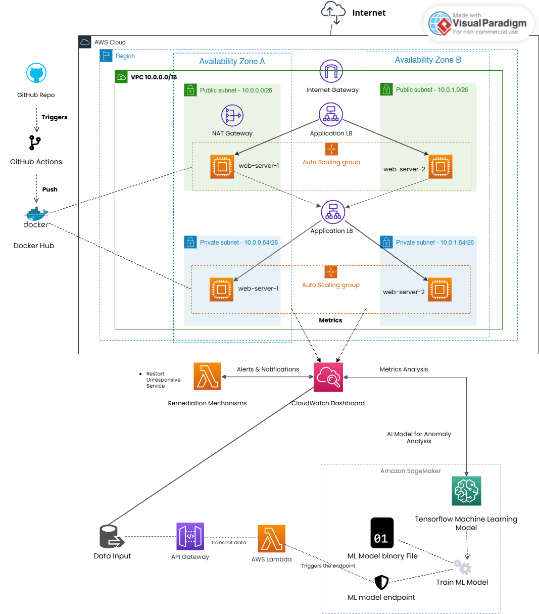
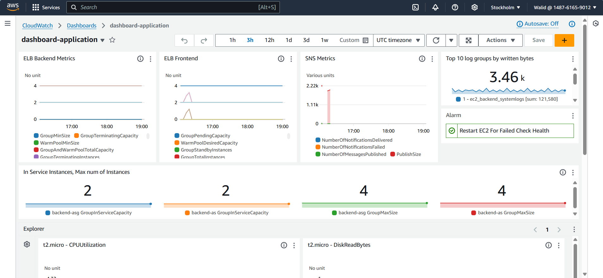
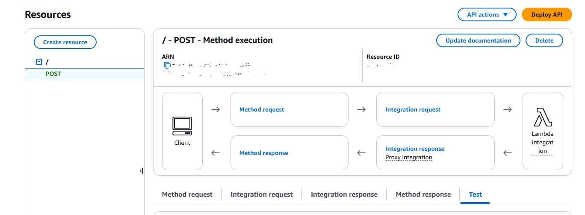

# **AWS Cloud Infrastructure Project**

## **Objectives**
- Set up a highly available AWS architecture using Terraform.
- Automate monitoring, logging, and remediation processes using CloudWatch and AWS lambda.
- Detect anomalies based on instance's logs by developing and deployed a machine learning using AWS Sagemaker. 
- Integrate CI/CD pipelines for seamless application deployment with GitHub Actions.
- Ensure scalability using Auto Scaling Groups and Load Balancers.
- Utilize Docker for containerization of the frontend and backend.
- Implement efficient log handling and insights via CloudWatch.

---

## **Step 1**
This part involves designing, implementing, and deploying a scalable, fault-tolerant, and highly available cloud-based application using AWS. The infrastructure includes a frontend hosted in a public subnet, a backend hosted in a private subnet, and integration with AWS services for monitoring, logging, and automation. The application is containerized, and CI/CD pipelines are utilized for streamlined deployments.

---

## **Step 2**
The part involves deploying a deep learning model on AWS SageMaker, implementing a Lambda function to interact with the model, and integrating it with an API Gateway for seamless HTTP-based communication. The focus is on creating a system that processes incoming data, reshapes it to meet the model's requirements, and invokes the SageMaker endpoint for predictions.

---

## **Tasks and Implementation**

### **1. Initial Infrastructure Setup**
- **Frontend:** Deployed in a public subnet of a Virtual Private Cloud (VPC).
- **Backend:** Deployed in a private subnet with communication restricted to the frontend.
- **VPC Configuration:**
  - Created public and private subnets across two availability zones.
  - Configured route tables for internet and internal communications.
- **Security Groups:** Configured to allow HTTP/HTTPS traffic for frontend and restricted backend communication to internal traffic.

---

### **2. Monitoring and Logging**
- **CloudWatch Integration:**
  - Installed CloudWatch Agent on EC2 instances to send system and application logs.
  - Configured metrics to monitor instance performance, such as CPU utilization, disk I/O, and memory.
- **Load Balancer Logs:**
  - Enabled access logs for the Application Load Balancer (ALB).
  - Configured an S3 bucket with proper permissions to store access logs.
- **Automation with AWS Lambda:**
  - Set up Lambda functions to monitor specific conditions (e.g., high CPU usage) and trigger remediation actions, such as scaling or instance reboot.
- **Dashboard Setup**

  

---

### **3. High Availability and Fault Tolerance**
- **Multi-AZ Architecture:**
  - Deployed resources across two availability zones for resilience.
  - Configured a Load Balancer to distribute traffic evenly across instances.
- **Auto Scaling Group:**
  - Set up Launch Templates to define EC2 instance configurations.
  - Configured scaling policies based on metrics such as average CPU utilization.

---

### **4. Containerization**
- **Frontend and Backend:**
  - Created Docker images for both applications.
  - Built multi-stage Dockerfiles for optimal image size and performance.
  - Hosted frontend and backend images on Docker Hub for easy retrieval.
- **CI/CD Pipeline Integration:**
  - Configured GitHub Actions workflows to build and push Docker images.
  - Automated deployment of containers to the Auto Scaling Group instances.

---
### **5. Data Preparation**
- Log entries are the primary input data. These logs are preprocessed into numerical and structured formats for model consumption. Example data includes:
- Fields:
  - **@timestamp**: Converted to a UNIX timestamp.
  - **@message**: Encoded based on message length.
  - **@logStream**: One-hot encoded for categorical differentiation.
  - **@log**: Encoded using text length.
- **Input Structure**:
  - After preprocessing, each log entry is converted into a 4-dimensional array matching the model's input requirements.

---
### **6. Model Deployment on AWS SageMaker**
- **Framework**: A TensorFlow model was deployed on SageMaker. The model expects 4D input and processes instances for predictions.
- **Endpoint Configuration**: SageMaker endpoint is set up to handle real-time inference requests. Proper security practices ensure endpoint       confidentiality and prevent exposure of sensitive data.

---
### **7. Lambda Function**
- The Lambda function serves as the backend processor for API Gateway requests, performing:
 - **Input Validation**: Ensures payload compliance with the required structure.
 - **Data Reshaping**: Converts input to a specific format compatible with the model .
 - **Model Invocation**: Sends formatted data to the SageMaker endpoint and retrieves predictions.
 - **Error Handling**: Returns HTTP status codes (200 for success, 400/500 for errors).

---
### **8. REST API Integration with API Gateway**
- **API Gateway Design**:
 -  **HTTP Method**: POST
 -  **Request Body**: Receives a JSON payload with data key (e.g., {"data": [1, 2, 3, 4]}).
 -  **Response**: Returns the prediction results in JSON format.
- **Lambda Handler**:
 - The Lambda function is designed to read the API Gateway payload, validate and preprocess the input, call the SageMaker endpoint, and return the prediction.
- **API Gateway**

---
### **9. Anomaly Detection Pipeline(On production)**
- **Log Collection with CloudWatch**
 - **Log Collection:**
    - Installed CloudWatch Agent on EC2 instances to capture system and application logs.
    - Defined log streams to aggregate data for easier analysis.
 - **Custom Metrics:**
    - Configured CloudWatch to capture specific application events for potential anomalies.
- **Data Pipeline**
  - **1- Triggering the Process:**
    - CloudWatch Logs trigger an AWS Lambda function when new log data is added.
  - **2- Preprocessing:**
    -  Logs are cleaned and preprocessed in Lambda to extract relevant features.
    -  Data is reshaped to meet the SageMaker model’s input requirements.
  - **3- Prediction Flow:**
    - The preprocessed data is sent to an API Gateway.
    - The Gateway passes the data to a SageMaker endpoint via Lambda for real-time predictions.
    - The model identifies anomalies and returns the results to the client.
---
